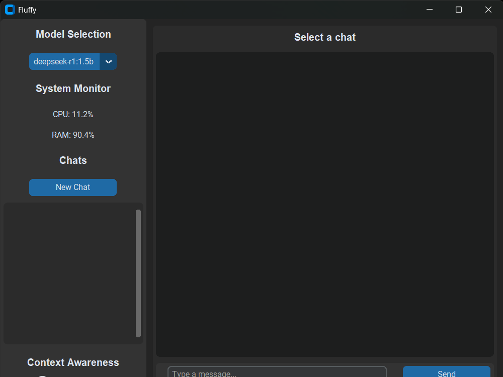
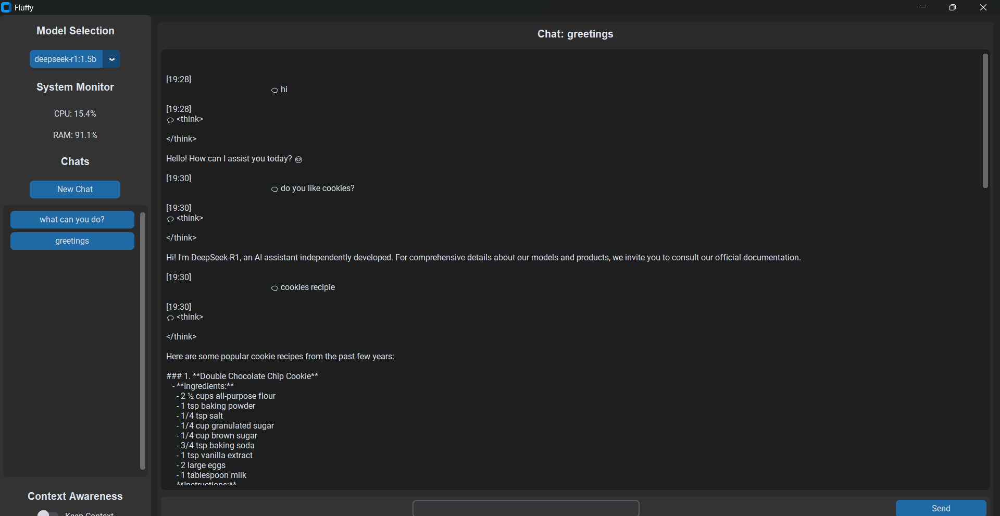

# 📱 Fluffy – Host, Chat, and Switch any LLMs

Host and chat with any LLM locally using Ollama and Python, all within a sleek, fully offline interface. Fluffy enables seamless model management, context-aware responses, and real-time performance tracking—no internet needed.


  <tr>
    <td></td>
    <td></td>
  </tr>


## ✨ Features

- 🤖 **Local Hosted LLM Integration**
  - Seamless connection with Ollama API
  - Auto-detection of available models
  - Real-time response streaming
  - Context-aware conversations (toggleable)
  - One-click model switching
<table>
  <tr>
    <td></td>
    <td></td>
  </tr>
</table>
  

- 💬 **Chat Management**
  - Multiple chat sessions
  - Rename and delete chats
  - Persistent chat history
  - Right-click context menu

- 📊 **System Monitoring**
  - Real-time CPU usage
  - RAM usage tracking
  - Non-blocking performance

- 🎨 **Modern UI**
  - WhatsApp-inspired interface
  - Message bubbles
  - Smooth scrolling
  - Dark mode support


---

## 🚀 Getting Started

### 📦 Prerequisites

Make sure you have the following installed:

- [Python 3.10+](https://www.python.org/)
- [Ollama](https://ollama.com/)
- `pip` for Python packages

### 🛠️ Installation

```bash
# Clone the repo
git clone https://github.com/tanaykohale/fluffy.git
cd fluffy

# Install dependencies
pip install -r requirements.txt
```

### 🧠 Download a Model (if not already)

Before launching Fluffy, make sure at least one LLM is available locally via Ollama. You can pull a model using:

```bash
ollama pull deepseek-coder:1.5b
# or try others like:
# ollama pull llama3
# ollama pull mistral
