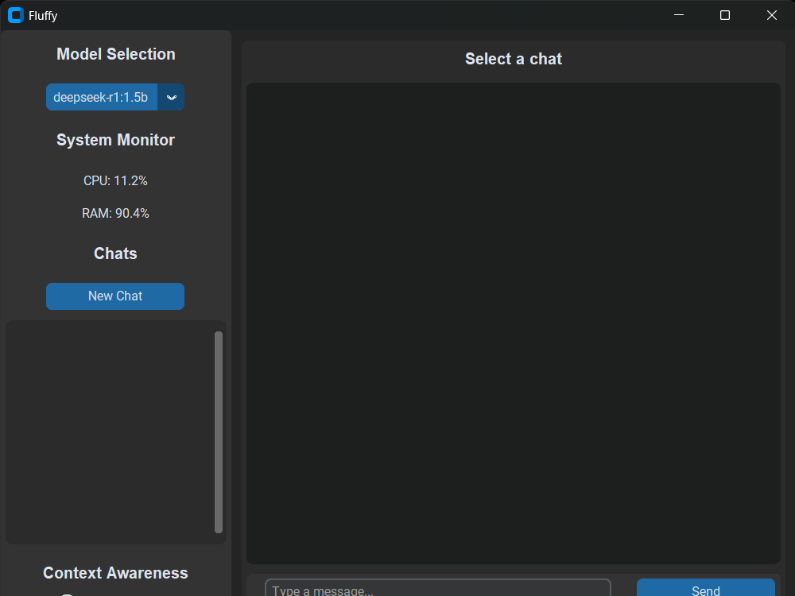
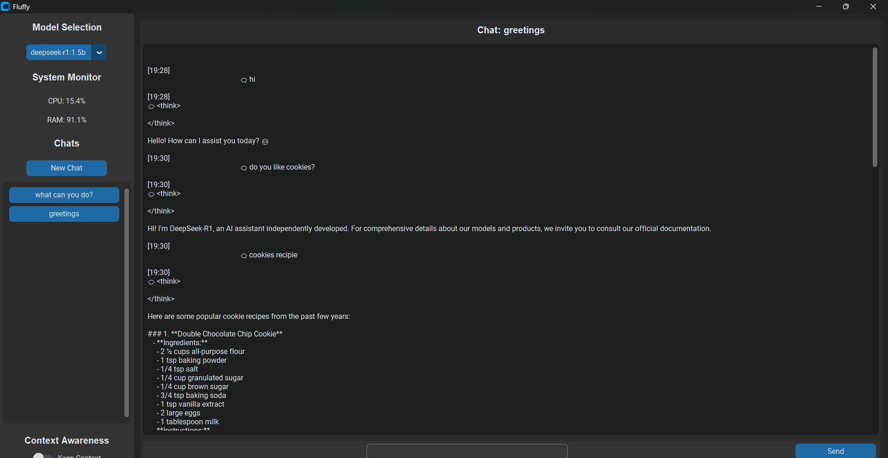

# 📱 Fluffy – Host, Chat, and Switch any LLMs

Host and chat with any LLM locally using Ollama and Python, all within a sleek, fully offline interface. Fluffy enables seamless model management, context-aware responses, and real-time performance tracking, plus **RAG over your own files** — no internet needed.


<table>
  <tr>
    <td></td>
    <td></td>
  </tr>
</table>


## ✨ Features

- 🤖 **Local LLMs via Ollama**
  - Auto-detects installed models, one-click switching, *Refresh models* button
  - Real-time **streaming** replies (generation runs on a background thread, UI stays responsive)
  - Context-aware conversations (toggleable, token-budgeted history)
<table>
  <tr>
    <td></td>
    <td></td>
  </tr>
</table>

- 📚 **RAG — chat with your own files**
  - *Add files to knowledge* → `.txt .md .py .csv .json` (and `.pdf` with `pypdf`)
  - Files are chunked (800 chars, 150 overlap) and embedded locally with an Ollama embedding model (default `nomic-embed-text`)
  - Turn on *Use my files (RAG)* → the top-4 most similar chunks (cosine similarity) are injected as context, with file names cited
  - Index is a plain JSON file at `~/.fluffy/rag_index.json` — no vector DB needed

- 💬 **Chat management**
  - Multiple chats, rename / delete via right-click
  - Persistent history (`~/.fluffy/chats.json`), per-chat logs, JSON export/import

- 📊 **System monitor** — live CPU and RAM usage

- 🎨 **UI** — CustomTkinter, dark mode

---

## 🚀 Getting Started

### Prerequisites
- [Python 3.10+](https://www.python.org/) with Tkinter (included in the Windows/macOS installers; on Linux `sudo apt install python3-tk`)
- [Ollama](https://ollama.com/) running locally

### Install
```bash
git clone https://github.com/tanaykohale/fluffy.git
cd fluffy
pip install -r requirements.txt
```

### Pull models
```bash
ollama pull llama3.2           # any chat model: mistral, deepseek-coder:1.5b, ...
ollama pull nomic-embed-text   # embedding model, only needed for RAG
```

### Run
```bash
python run.py
# options:
python run.py --ollama-url http://localhost:11434 --embed-model nomic-embed-text
```

---

## 🧪 Tests

Tests do **not** need Ollama — HTTP calls are faked.

```bash
pip install -r requirements-dev.txt
pytest                      # unit tests (Ollama client, RAG, chat manager)
xvfb-run -a pytest          # Linux: also runs the end-to-end GUI test on a virtual display
```

`tests/test_gui_e2e.py` opens the real window, starts a fake Ollama server on localhost, sends a message, checks the streamed reply, indexes a file and verifies the RAG context reaches the model. On Windows/macOS it runs with plain `pytest`.

---

## 🗂 Project structure
```
run.py                      entry point
src/main.py                 CLI args, wires services + window
src/services/ollama_service.py   /api/tags, /api/chat (streaming), /api/embed
src/services/rag.py              chunking, embeddings, cosine search, JSON index
src/services/chat_manager.py     chats, context window, persistence
src/services/system_monitor.py   CPU/RAM polling thread
src/ui/                          sidebar, chat display, main window
tests/                           pytest suite
```
